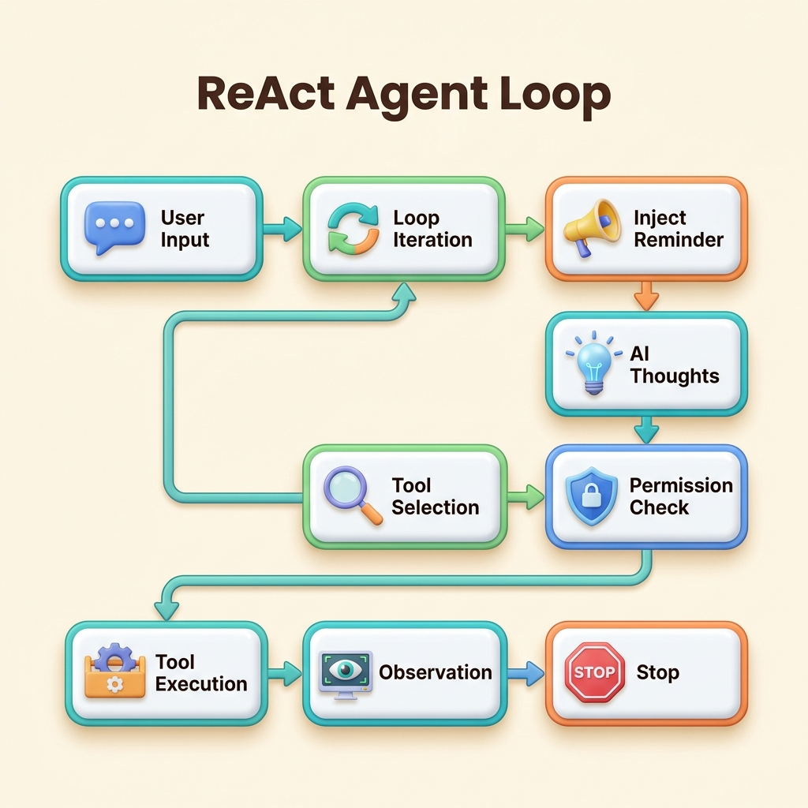
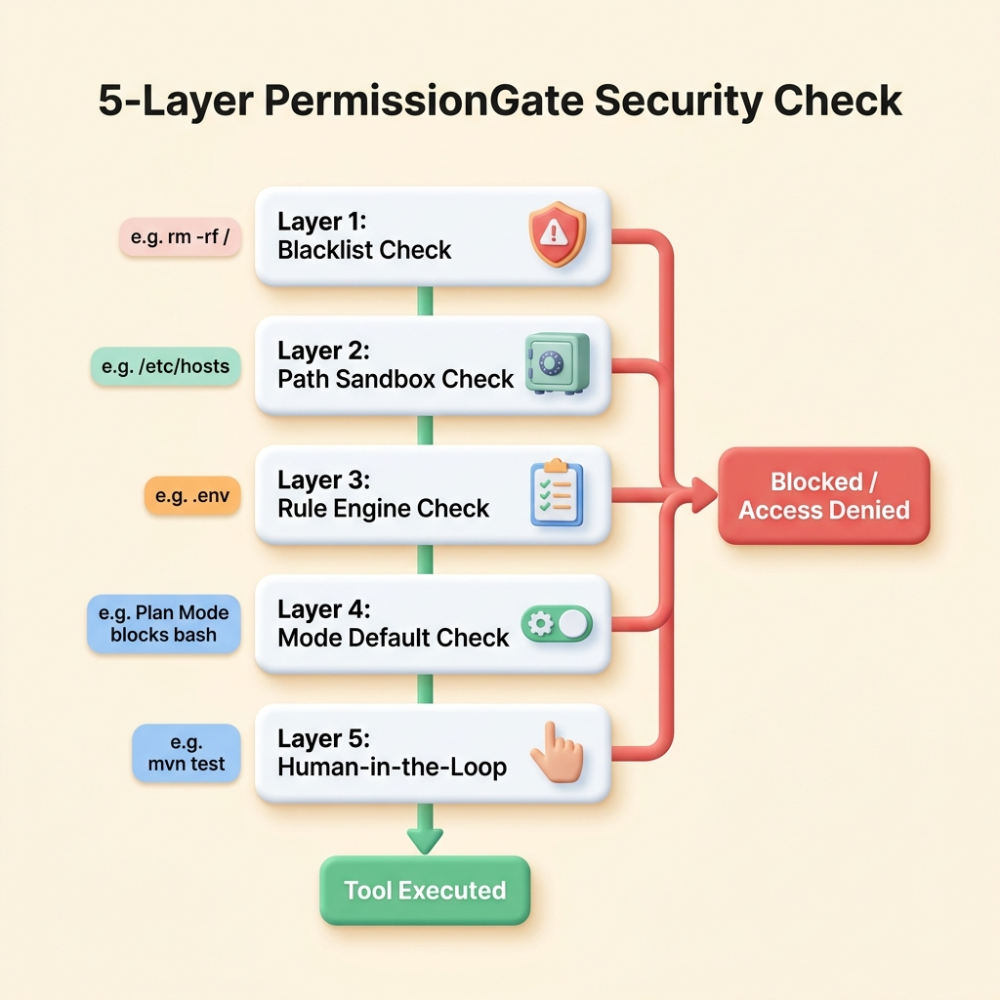
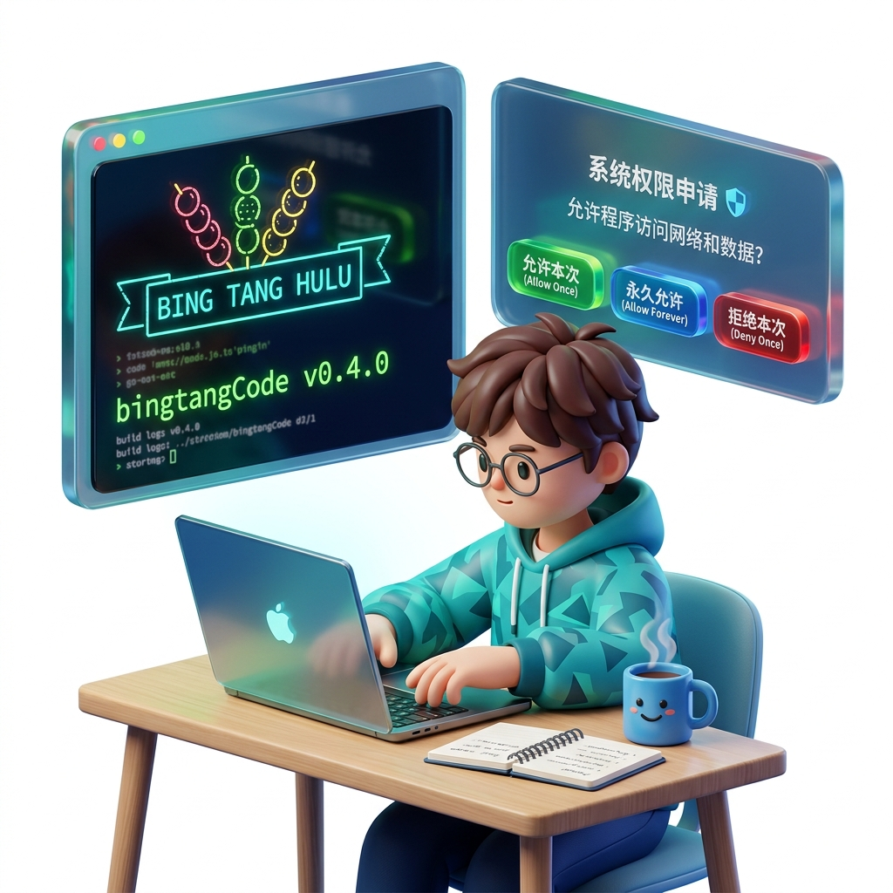
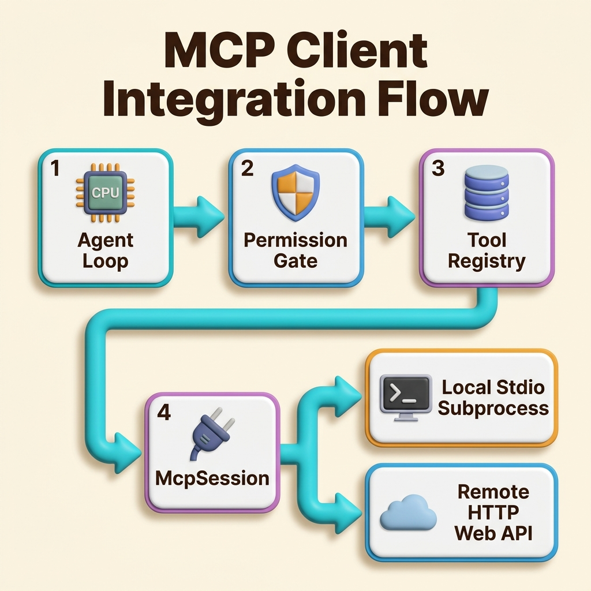

# bingtangCode

终端 AI 编程助手 — 在命令行里与 AI 对话，让它自主调用工具完成编程任务。

## 项目目标

构建一个类 Claude Code 的终端 AI 编程助手。

- 支持多 LLM provider（Anthropic / OpenAI），通过配置文件切换
- ReAct Agent Loop：模型自主思考→调工具→观察结果→再思考，多轮循环直到任务完成
- MCP 客户端集成：支持本地 stdio（子进程管道）与远程 Streamable HTTP 协议，实现外部工具自动发现、注册与安全调用
- 结构化系统提示：7 模块按职责组装，稳定内容走 SYSTEM 可缓存，动态内容走消息通道
- Plan Mode 运行时注入：通过 `<system-reminder>` 标签按轮次注入模式提醒，控制频率和详略
- 流式输出，AI 回复逐字呈现，推理过程可配置显示
- 六个核心工具：读文件、写文件、编辑文件、执行命令、搜索文件、搜索内容
- 五层防御权限系统：黑名单→路径沙箱→规则引擎→模式兜底→人在回路
- 事件驱动架构，模块完全解耦
- Java 21，终端原生体验
- 本地快捷命令系统：前缀拦截过滤、去重匹配联想、JLine Raw 模式下的 ActionListBox 交互菜单（如会话重置 `/clear`、历史切换 `/resume`、状态查询 `/status` 等），零延迟且不耗 Token

## 核心流程与架构图示

### 1. ReAct Agent Loop 运行机制

项目运行基于 ReAct（Reasoning and Acting）循环，模型在接收到任务后，会自主经历“思考 -> 选择工具 -> 权限检查 -> 执行工具 -> 观察结果”的循环，直到任务最终完成或触发终止条件。


*(下图以 3D 卡通微立体风格展示了 ReAct Agent Loop 运行时的各阶段逻辑与反馈 Loop 连线)*

- **思考（Thoughts）**：模型在内部生成推理，分析当前任务阶段并决定下一步行动。
- **工具选择（Tool Selection）**：根据需要调用注册的 6 个核心工具之一（只读工具或副作用工具）。
- **权限安全网（Permission Gate）**：所有工具调用必须先通过五层拦截。
- **执行与观察（Execution & Observation）**：在获得允许后执行工具，并将执行结果作为下一次循环的输入。
- **Plan 模式注入**：循环中根据轮次注入动态 Reminder 提醒，控制模型的行为准则。

---

### 2. 五层防御权限系统 (PermissionGate)

为了确保执行 `execute_command`（如 Bash 命令）及文件修改工具时的安全性，项目实现了一套严密的五层防御编排机制：


*(下图以 3D 卡通微立体风格展示了五层防御系统的拦截流，左侧配有每一层过滤的典型实例与立体拟物图标)*

1. **第一层：黑名单 (Blacklist)**：硬编码 19 条高危命令正则（如 `rm -rf /` 等），检测到即强制阻断，不可绕过。
2. **第二层：路径沙箱 (Path Sandbox)**：针对所有文件操作工具，解析符号链接并严格校验路径必须在项目根目录下，防止越权读写。
3. **第三层：规则引擎 (Rule Engine)**：加载三层 YAML 配置文件（local > project > user），匹配 Glob 规则并遵循 Deny 优先原则。
4. **第四层：模式兜底 (Mode Default)**：依据当前权限模式（DEFAULT / PLAN / ACCEPT_EDITS / BYPASS）的安全级，决定是直接允许还是进入下一层拦截。
5. **第五层：人在回路 (Human-in-the-Loop)**：对无法自动决策的工具调用，在终端弹出交互提示，由用户控制允许单次、永久允许或拒绝。

---

### 3. 终端交互界面设计 (Terminal UI)

下面是 `bingtangCode` 交互终端的结构与人在回路 (HITL) 询问框的示意图：



- **顶部 Banner**：启动时在终端呈现 `BING TANG HULU` 字符画及版本号、模型等系统配置。
- **交互区域**：提供多行输入及流式输出效果。当触发人在回路时，弹出带有磨砂玻璃拟态的交互面板，供用户通过键盘键入或选择授权。
- **底部状态栏 (Status Bar)**：实时显示当前分支、使用模型以及累积消耗 Token 统计。

---

### 4. MCP (Model Context Protocol) 客户端集成

项目支持通过 MCP 标准协议集成外部的本地或网络工具，实现工具的即插即用和自动发现：


*(下图以 3D 卡通微立体风格展示了 MCP 客户端与系统其他模块的交互及物理连接流程)*

- **配置驱动**：通过本地项目配置及全局用户配置定义外部 MCP 服务器，支持 `${VAR}` 环境变量热替换。
- **并行连接（虚拟线程）**：使用 Java 21 虚拟线程在启动时并发连接各服务，提供 30s 独立超时隔离，确保主程序不卡顿。
- **自动发现与注册**：支持三步握手获取工具元数据并注册，生成的外部工具格式为 `mcp__<server>__<tool>`。
- **安全对接**：外部工具自动跳过本地黑名单与文件沙箱（由子进程负责），受控于 Layer 3 规则引擎，并在 Layer 4/5 依据 `isReadOnly()` 属性实现只读放行与写操作人在回路分流拦截。

---

## 当前进度

**v0.9 — 斜杠命令与本地控制命令系统 (当前版本)** 已完成：

| 机制/模块 | 说明 |
|------|------|
| 命令前缀拦截与分流 | 对以 `/` 开头的输入进行强拦截与大小写不敏感解析，提取首个空格前内容为命令名，其余为参数并传入 `CommandContext`。支持空 `/` 引导，完全绕过大模型对话主循环，零网络延迟 |
| 启动期防重碰撞校验 | 在启动装配阶段通过 `CommandRegistry` 对命令名称和别名的全小写格式进行排他性冲突扫描，一旦发现命名冲突或别名碰撞，立即抛出 `IllegalStateException`（Fail-Fast） |
| 三种命令执行模式 | 划分 `LOCAL`（本地只读）、`LOCAL_UI`（影响 UI 状态与切换会话）、`PROMPT`（注入预设提示词并立即启动 ReAct 对话）三类执行模式，各司其职 |
| 界面接口抽象解耦 | 声明 `UIController` 接口将命令的具体清屏、刷新、选择等操作与终端物理渲染（JLine3）完全解耦，极大地提升了系统的可测试性与平台移植能力 |
| JLine3 Tab 补全去重 | 自定义 JLine3 `Completer` 挂载 Tab 键补全，并优化联想算法排除别名候选，只推荐 12 个规范的命令主名以避免菜单冗余，支持隐藏命令过滤 |
| ActionListBox Raw 菜单 | 开启终端 Raw Mode 捕获上下键和回车/ESC。通过精确光标位移与局部擦除，提供无闪烁的交互式历史会话单选框 |
| 12 个内置高频命令 | 集中实现 `/exit`、`/plan`、`/do`、`/compact`、`/status`（格式化双列输出六指标）、`/memory`（列出已加载记忆文件名并去重）、`/permission`、`/session`、`/review`（代码审查提示词注入）、`/clear`（会话级关闭新建、WAL 文件重置与清屏）、`/resume` 和 `/help`（中英文视觉宽度自适应对齐边框卡片）等命令的业务逻辑 |

**v0.8 — 记忆系统与历史会话持久化** 已完成：

| 机制/模块 | 说明 |
|------|------|
| 多层指令拼接与沙箱 | 支持项目根目录、项目本地（.bingtangcode/）和用户目录（~/.bingtangcode/）下 `BINGTANGCODE.md` 动态拼接。限制 5 层嵌套与环路死锁检测，设立绝对路径沙箱防目录逃逸 |
| 会话 WAL 追加落盘 | 以 $O(1)$ 磁盘追加写（WAL）格式将 Message 实时记录于 `.jsonl` 文件。支持无元数据文件的高效会话列表加载与时间戳/首条 User 消息标题计算 |
| 一致性校验与回滚 | 读档时自动过滤坏行。通过 `validateMessageChain` 自动检测并剔除尾部悬挂（未闭合）的工具调用，避免云端 API 请求报错 |
| 6 小时长暂停提示 | 检测到相邻消息时间戳间隔 $\ge$ 6 小时，自动在内存中向大模型历史上下文注入一条带有明确暂停时长的系统时效性警告提示 |
| 30 天过期自动清理 | 启动时异步扫描清理 30 天前的 `.jsonl` 历史文件与相关的外部大工具结果保护目录，节约磁盘空间 |
| 异步记忆沉淀索引 | 对话结束后由后台线程异步调用 LLM 提炼用户偏好、纠正反馈、项目知识、参考资料四类笔记，自维护 200 行以内的 `MEMORY.md` 索引与记忆碎片 |

**v0.7 — 对话上下文管理机制** 已完成：

| 机制/模块 | 说明 |
|------|------|
| 轻量拦截落盘预防 | 工具单项结果过大（默认 >50KB）或本轮累计结果过大（默认 >200KB）时，自动执行本地冷文件落盘并提供精细字节安全预览，阻断 Context 瞬间爆仓 |
| 历史重量兜底压缩 | 逼近物理窗口上限时自动触发。调用专属 LLM 剥离思考草稿生成 9 部分结构化 Markdown 摘要，无感替换早期冗长历史 |
| 增量 Token 估算模型 | 混合计算模型：基于上轮 API Usage 回传真实 token 数据作为基准锚点，对增量消息按比率换算累加，规避纯字符累积估算偏差 |
| 双下界近期原文保留 | 从尾部向前追溯，强制保留至少 10K Token 且消息数 $\ge$ 5 条作为近期记忆原文不被压缩，维系大模型的精准即时上下文精度 |
| 失败熔断与优雅降级 | 摘要生成连续失败 3 次时自动关闭后台自动压缩，并在前台抛出警告但允许本轮请求照常发送，在网络不佳时实现防死循环优雅降级 |
| 系统控制参数解耦 | 将上述所有的控制阈值、余量、重试限制、MCP 超时等隐式魔法数解耦并外置至 `config.yaml` 集中管理，提供向下兼容和默认值兜底 |

**v0.6 — MCP 客户端集成** 已完成：

| 模块 | 说明 |
|------|------|
| 配置管理与合并 | 支持项目级覆盖用户级配置，并支持 `${VAR}` 环境变量展开（未定义时输出 stderr 告警并置空） |
| 传输层实现 | 实现 `StdioTransport`（子进程管道直连，后台虚拟线程循环读取并按 ID 匹配响应）与 `HttpTransport`（同步网络 POST 通信，禁用 SSE） |
| 会话握手控制 | 实现 `McpSession` 自动执行 initialize 握手、initialized 通告、以及 tools/list 列表拉取，统一生成并管理消息序列 ID |
| 工具适配转换 | `McpToolAdapter` 适配外部工具为本地 `Tool`。实现命名正则校验、`readOnlyHint` 只读属性绑定、以及非文本响应块过滤（首次 stderr 一次性警告） |
| 并发与退出管理 | `McpManager` 采用虚拟线程并发连接各服务（30s 限时）。挂载 JVM Shutdown Hook 实现在退出时并发 close（5s 超时兜底销毁子进程） |
| 权限系统无感对接 | 外部工具自动豁免本地文件沙箱和高危命令黑名单校验，复用 Layer 3 规则引擎阻断，并在 Layer 4/5 实现只读自动放行与写操作 HITL 拦截 |

**v0.5 — 五层防御权限系统** 已完成：

| 模块 | 说明 |
|------|------|
| PermissionMode | 四档权限模式（Default / AcceptEdits / Plan / Bypass），控制默认行为和工具过滤 |
| Blacklist | 19 条高危命令正则硬编码，不可绕过，任何模式下均生效 |
| PathSandbox | 统一路径校验 + `toRealPath()` 符号链接解析，5 个文件工具共用 |
| RuleEngine | 三层 YAML 规则匹配（local > project > user），glob 模式 + deny 优先 |
| PermissionGate | 五层防御编排（黑名单→沙箱→规则→模式→人在回路），集中拦截 |
| PermissionPrompt | 人在回路终端 UI，箭头键动态选择「允许本次/永久允许/拒绝本次」 |
| 规则持久化 | ALLOW_FOREVER 写入 `permissions.local.yaml`，下次自动生效 |
| 模式合并 | AgentLoop.Mode 统一为 PermissionMode，`/mode` 菜单 + Shift+Tab 切换 |
| 连续拒绝保护 | 连续 5 轮全工具被权限拒绝则触发 PERMISSION_DENIED_LOOP 终止 |

### v0.4 — 系统提示工程

| 模块 | 说明 |
|------|------|
| SystemPromptBuilder | 7 个固定模块按优先级组装（身份→系统约束→任务模式→动作执行→工具使用→语气风格→文本输出）+ 环境信息，稳定指令可缓存 |
| SystemReminderManager | Plan 模式提醒按 Agent Loop 轮次注入，首轮完整 + 每 3 轮重复 + 其余精简，`/do` 停止注入 |
| AgentLoop 集成 | 每轮 doRound 前注入提醒，模式切换时通知，`<system-reminder>` 消息不走 API 缓存前缀 |
| 工具描述双重强化 | EditFileTool + WriteFileTool 描述中追加关键约束，与系统提示互补 |
| 推理显示可配置 | `show_reasoning` 配置项控制是否灰显推理过程，false 时静默跳过 |
| 版本号软编码 | pom.xml 定义版本，Maven 资源过滤注入，启动时读取显示 |

### v0.3 — Agent Loop

| 模块 | 说明 |
|------|------|
| Agent Loop | `AgentLoop` ReAct 循环，模型自主多轮调工具，20 轮上限 + 6 种停止条件 |
| 事件总线 | `EventBus` + 8 种 `AgentEvent`，AgentLoop/DialogueManager 发事件，TUI 订阅消费 |
| Plan Mode | `/plan` 切换只读工具集（调研模式），`/do` 恢复全量工具（执行模式） |
| 工具系统 | `Tool` 接口（含 `isReadOnly`） + `ToolRegistry` + `ToolExecutor` 超时执行 |
| 六个核心工具 | `read_file` / `write_file` / `edit_file` / `execute_command` / `find_files` / `search_content` |
| 分批工具执行 | 只读工具并发、副作用工具串行，结果按原始顺序回灌 |
| 流式双路收集 | `DialogueManager.doRound()` 内部一边推 EventBus 渲染终端，一边积攒写历史 |
| Token 用量追踪 | 流式实时累计 + 每轮 API 精确修正，终端底部状态栏显示 |

### Out of Scope（当前不做）

工具执行沙箱、代码高亮、Markdown 渲染、自动化评估、网络请求限制、资源配额、审计日志

## 快速开始

### 环境要求

- Java 21+
- Maven 3.8+

### 构建

```bash
git clone https://github.com/MySoulForYou/bingtangcode.git
cd bingtangcode
mvn package -DskipTests
```

### 配置

```bash
cp config.example.yaml config.yaml
```

编辑 `config.yaml`，填入你的 API Key：

```yaml
provider: anthropic              # 或 openai

anthropic:
  api_key: "sk-ant-xxxxx"
  model: claude-opus-4-7

openai:
  api_key: "sk-xxxxx"
  model: gpt-4o
  # endpoint: https://api.openai.com/v1/chat/completions  # 可选，也支持 DeepSeek 等兼容接口

context:
  window: 128000                 # 物理窗口 Token 限制（默认 128000）
  # keep_recent_tokens: 10000    # 可选，压缩时最少保留的尾部近期 Token 长度（默认 10000）
  # keep_recent_messages: 5      # 可选，压缩时最少保留的尾部近期消息数量（默认 5）

tool:
  timeout_seconds: 30
  result_limit: 50000            # 单项工具结果落盘阈值（默认 50000 字节）
  result_total_limit: 200000     # 累计工具结果落盘保护阈值（默认 200000 字节）

agent:
  max_iterations: 20             # Agent Loop 最大迭代次数
```

### 权限配置（可选）

三层 YAML 规则文件，优先级 local > project > user：

```bash
# 用户全局（所有项目生效）— 首次启动自动创建
~/.bingtangcode/permissions.yaml

# 项目共享（可提交 Git）
<project>/.bingtangcode/permissions.yaml

# 项目本地（不提交 Git，ALLOW_FOREVER 写入此处）
<project>/.bingtangcode/permissions.local.yaml
```

### 运行

```bash
java -jar target/bingtangcode-0.8.0.jar
```

### 命令

| 命令 | 说明 |
|------|------|
| `/plan` | 切换到 Plan Mode，仅可用只读工具 |
| `/do` | 切回 Default Mode，全工具可用 |
| `/mode` | 打开权限模式选择菜单（箭头键选择） |
| Shift+Tab | 循环切换四档权限模式 |
| `/compact` | 手动触发对话历史结构化摘要压缩 |
| `/help` | 显示帮助 |
| `/clear` | 清除屏幕 |
| `/exit` 或 `/quit` | 退出 |

## 项目结构

```
src/main/java/com/bingtangcode/
├── Main.java                    # 入口，组装所有组件
├── config/
│   └── ConfigManager.java       # YAML 配置读取
├── core/
│   ├── SessionManager.java      # REPL 主循环，命令解析，/mode 菜单
│   ├── DialogueManager.java     # 对话历史 + doRound() 单轮执行 + 权限检查 + 预防超限落盘
│   ├── RoundResult.java         # doRound 返回结果（含 allPermissionDenied）
│   ├── SystemPromptBuilder.java # 7 模块系统提示组装 + EnvInfo
│   ├── SystemReminderManager.java  # Plan 模式提醒频率控制
│   ├── ContextCompressor.java   # 对话历史摘要提取（大模型同步流式处理 + 草稿剥离）
│   ├── InstructionLoader.java   # 多层级静态指令加载与沙箱隔离
│   ├── SessionSerializer.java   # 会话记录的 JSONL 序列化与反序列化转换
│   ├── SessionPersister.java    # 会话 WAL 追加写入与 30 天过期清理
│   ├── SessionRecovery.java     # 会话坏行跳过、工具链一致性校验与长暂停注入
│   └── AutoMemoryCollector.java # 异步记忆收集器与 MEMORY.md 索引维护
├── agent/
│   ├── AgentLoop.java           # ReAct 循环控制器 + PermissionModeProvider
│   ├── AgentEvent.java          # 8 种事件类型 + 6 种停止原因
│   ├── AgentEventListener.java  # 监听器接口
│   └── EventBus.java            # 事件总线
├── permission/
│   ├── PermissionMode.java      # 四档模式枚举 + DefaultAction
│   ├── PermissionAction.java    # ALLOW / DENY
│   ├── PermissionRule.java      # 规则 record
│   ├── PermissionResult.java    # 检查结果 record
│   ├── ToolFriendlyName.java    # 内部名→友好名 + 主参数提取
│   ├── Blacklist.java           # 19 条高危命令正则
│   ├── PathSandbox.java         # 路径校验 + 符号链接解析
│   ├── PathViolationException.java
│   ├── RuleEngine.java          # 三层规则匹配（local > project > user）
│   ├── PermissionGate.java      # 五层防御编排
│   ├── PermissionPrompt.java    # 人在回路终端 UI（箭头键选择）
│   ├── PermissionConfigLoader.java  # 三层 YAML 加载 + 首次启动自动创建
│   ├── PermissionConfigManager.java  # ALLOW_FOREVER 持久化
│   ├── AskResult.java           # 人在回路结果枚举
│   ├── HumanInTheLoopHandler.java    # 人在回路接口
│   └── PermissionModeProvider.java   # 动态模式获取接口
├── llm/
│   ├── LLMProvider.java
│   ├── Message.java
│   ├── Role.java
│   ├── StreamCallback.java
│   └── LLMimpl/
│       ├── AnthropicProvider.java
│       └── OpenAIProvider.java
├── tool/
│   ├── Tool.java
│   ├── ToolCall.java
│   ├── ToolResult.java
│   ├── ToolRegistry.java
│   ├── ToolExecutor.java
│   └── tools/
│       ├── ReadFileTool.java
│       ├── WriteFileTool.java
│       ├── EditFileTool.java
│       ├── ExecuteCommandTool.java
│       ├── FindFilesTool.java
│       └── SearchContentTool.java
└── tui/
    ├── TerminalIO.java          # 终端输入输出（JLine3 + 状态栏 + 读键）
    ├── TuiEventListener.java    # 事件→终端渲染
    └── BuddyManager.java
```

## 技术栈

- **语言**: Java 21
- **构建**: Maven + maven-shade-plugin（fat jar）
- **终端**: JLine3（行编辑、历史、信号处理、raw mode 读键）
- **HTTP**: OkHttp 4
- **JSON/YAML**: Jackson
- **LLM API**: Anthropic Messages API / OpenAI Chat Completions API（SSE 流式）
- **架构**: 事件驱动（EventBus + sealed interface 事件类型）

## 许可证

MIT
